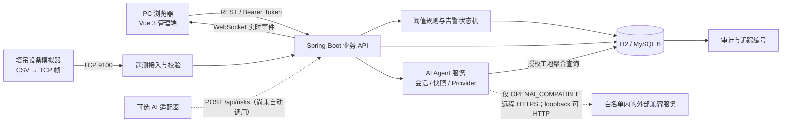
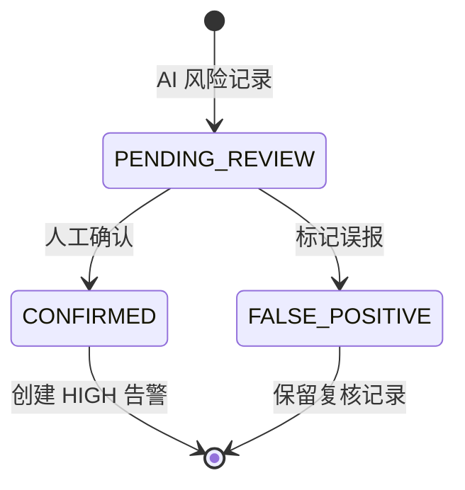

# 系统架构

## 1. 目标与边界

本系统面向 PC 浏览器上的建筑工地安全监管，主链路是“设备上报 → 数据校验 → 规则判断 → 告警合并 → 实时通知 → 人工处置 → 审计追踪”。它是可本地运行、可重复演示的实训实现，不把未提供的真实摄像头、喷淋网关或已验证 AI 运行环境描述成生产能力。

## 2. 总体结构

### 运行时端口

| 端口 | 进程 | 协议 | 说明 |
| --- | --- | --- | --- |
| 5173 | 前端 | HTTP | Vite PC 管理端，本地开发/演示使用 |
| 8080 | 后端 | HTTP、WebSocket | REST API 与 `/ws/events` |
| 9100 | 后端 | TCP | 遥测接入，4 字节大端长度 + UTF-8 JSON |
| 9200 | 模拟器 | HTTP、Socket.IO | 模拟器控制台 |
| 5001 | AI 适配器 | HTTP | `/health` 与 `/infer` |

## 3. 代码模块

### 3.1 PC 管理端 `frontend/`

| 层 | 主要文件 | 职责 |
| --- | --- | --- |
| 入口与路由 | `src/main.js`、`src/router.js` | 页面懒加载、登录守卫、角色路由限制、PC 页面标题 |
| 全局状态 | `src/store.js` | Token、用户、工地、区域/设备选择、WebSocket 状态和通知 |
| API 适配 | `src/api.js` | 统一 Bearer Token、JSON、错误与追踪编号处理 |
| 页面 | `src/views/` | 十四个业务模块，各自维护筛选、加载、空态和错误态；治理工作流与集成中心独立分区 |
| 通用组件 | `src/components/` | PC 壳层、图表、三维模型、工地区域、状态标签和分页 |
| 样式 | `src/styles.css` | 桌面端信息密度、表格、双栏详情和图表布局 |

前端不直接访问数据库，也不在客户端决定写操作权限；界面隐藏只是体验优化，最终权限由后端方法级鉴权执行。

### 3.2 业务 API `backend/`

| 包 | 职责 |
| --- | --- |
| `controller` | REST 输入、参数绑定和页面所需的聚合视图 |
| `service` | 遥测/规则/告警状态机；Agent 会话与已发布知识检索；知识/报告审核与受控推送；视频、视觉 AI、喷淋网关和监控适配器 |
| `security` | 随机 Token 会话、角色权限、工地数据范围和 CORS |
| `realtime` | WebSocket Token 鉴权、按用户工地范围隔离与尽力而为的事件投递 |
| `tcp` | 设备 TCP 帧读取、遥测写入和 ACK 返回 |
| `common` | 统一响应、业务异常、全局异常和请求追踪编号 |
| `config` | 空库确定性演示数据初始化，以及已有演示库的大型设备遥测和默认规则幂等补齐 |

### 3.3 设备模拟器 `device-simulator/`

模拟器读取 `data/tower_crane_data.csv` 作为两台塔吊的确定性输入，并在同一轮询队列中生成 `EL-001`、`FM-001`、`PIT-001` 的完整指标集。`protocol.js` 负责纯协议编码/解码与设备档案映射，`server.js` 负责五台设备的轮询、TCP 生命周期和网页控制，因此协议逻辑可以独立测试。默认每 5 秒发送一台设备，每台设备约 25 秒完成一次上报。

### 3.4 AI 适配器 `ai-service/`

AI 服务与主业务进程隔离。默认模式为 `DISABLED`，只有明确设置 `AI_DEMO_MODE=true` 才返回固定演示结果；`AI_ENABLE_MODEL=true` 才尝试加载 `models/last.pt`。无论模型输出如何，业务页面都要求人工复核后才生成告警。

### 3.5 数据层

核心表按领域分组：

| 领域 | 表 |
| --- | --- |
| 身份与范围 | `app_user`、`site`、`zone`；管理员通过用户管理模块维护账号、角色和工地范围 |
| 设备与遥测 | `device`、`telemetry` |
| 规则与告警 | `alarm_rule`、`alarm`、`alarm_action` |
| 视频与 AI | `camera`、`ai_risk` |
| 环境联动 | `sprinkler_task` |
| AI Agent | `ai_agent_provider_config`、`ai_agent_conversation`、`ai_agent_message`；个人服务商配置绑定用户且凭据加密，会话绑定用户与工地，消息绑定会话 |
| 知识与报告 | `knowledge_document`、`report_template`、`safety_report`；状态机和审核人均持久化 |
| 受控推送 | `push_channel`、`push_delivery`；报告只有审核通过后才能投递 |
| 可追溯性 | `audit_log` |

H2 使用 `schema.sql`；MySQL profile 使用 `schema-mysql.sql`。两套脚本当前各定义 20 张领域表并保持字段语义一致，但没有自动跨数据库迁移数据。

## 4. 关键业务流

### 4.1 登录与数据范围

1. `POST /api/auth/login` 验证 BCrypt 密码。
2. 服务端生成 256 位随机 Token，并在内存保存角色、可访问工地和过期时间。
3. 前端后续请求发送 `Authorization: Bearer <token>`。
4. 控制器先验证角色，再通过 `SecurityUtil.requireSite` 验证工地范围。
5. 页面打开 WebSocket，并用同一 Token 完成握手校验；实时中心为连接绑定该会话，并只投递 `payload.siteId` 位于用户 `siteIds` 范围内的事件。
6. 客户端可调用 `POST /api/auth/refresh` 原子轮换 Token，旧 Token 立即失效；当前 PC 端尚未定时主动刷新。
7. ADMIN 停用用户或重置密码后，服务端立即清理该用户现有会话；当前管理员不能停用自身。
8. ADMIN 只能查看或管理 `siteScope` 完全位于自身 `siteIds` 内的账号；审计列表也必须选择一个已授权工地并在服务端过滤。

### 4.2 遥测、规则与告警

1. REST 或 TCP 接收协议版本、消息编号、设备编号、采集时间和指标数组。
2. 服务端验证协议、设备启用状态、指标白名单和取值范围。
3. `messageId + metricCode` 唯一约束保证重复上报幂等。
4. 遥测刷新 `last_reported_at` 并恢复设备在线；可配置调度对超时设备执行条件更新，原子转为离线并创建或合并 `SYSTEM_DEVICE_OFFLINE` 告警。
5. 对启用规则逐项匹配；在抑制窗口内更新原告警次数，否则创建新告警。
6. 发布 `telemetry.updated`、`device.status.changed`、`alarm.created`、`alarm.updated` 或 `alarm.status.changed` 事件。
7. 监管员按 `PENDING → PROCESSING → RESOLVED → CLOSED` 单向处置；系统离线告警在遥测恢复时自动进入 `RESOLVED`，人工动作仍同时写 `alarm_action` 和 `audit_log`。

### 4.3 AI 风险复核

AI 置信度不是自动处置依据。只有 `CONFIRM` 会创建来源为 `AI_RISK` 的高等级告警。

### 4.4 AI Agent 问答与外部调用边界

1. 前端先读取 `/api/agent/config`；个人配置页面另读写 `/api/agent/provider-config`。后者只返回当前用户的 Base URL、模型、密钥是否已配置及管理员允许项，绝不返回 API Key 或数据库密文。
2. 会话由 `user_id + site_id` 隔离；列表只查询当前用户在所选工地的会话，读取消息和发送问题也会再次检查会话所有者与工地授权。
3. `AiAgentSiteSnapshotService` 只聚合固定范围的工地摘要；`KnowledgeDocumentService` 只追加当前工地、人工审核且状态为 `PUBLISHED` 的最多 3 个匹配摘录。草稿、待审、驳回和归档文档不会进入 Provider 上下文。
4. 用户存在有效个人配置时实际使用 `OPENAI_COMPATIBLE`，否则回退到全局模式；`DEMO` 在后端基于快照返回明确标记的确定性回答，不连接外部服务；全局 `DISABLED` 优先拒绝所有发送。
5. `AiAgentConversationLocks` 使用固定数量的公平条带锁，按会话 ID 将单个后端实例内同一会话的发送串行化，防止并发问题使用相同旧历史或乱序落库；固定条带避免为每个会话永久增长一把锁。锁通过有界 `tryLock` 等待，超时或线程中断返回 `AI_AGENT_BUSY`，不会无限占住请求线程。
6. 只有 `OPENAI_COMPATIBLE` 会发送当前问题、受数量上限约束的本会话历史和上述工地摘要。`AiAgentAdmissionService` 先以公平信号量限制单实例外部并发数，并按用户 ID 执行单实例固定分钟窗口限额；等待舱壁超时返回 `AI_AGENT_BUSY`，超过用户配额返回 `AI_AGENT_RATE_LIMITED`。
7. 外部 Base URL 必须精确命中服务端白名单；远程只接受 HTTPS，HTTP 仅接受主机精确为 `localhost`、`127.0.0.1` 或 `::1` 的本机联调地址，且客户端禁止跟随重定向。个人 API Key 用部署环境主密钥执行 AES-256-GCM 加密并绑定用户 ID，只在调用前短暂解密；密钥不下发浏览器、不写入会话或审计，保存响应也不回显。
8. Provider 对 2xx 响应先按 `maxResponseChars × 4 + 4096`（最高 132096 字节）有界读取，再反序列化 JSON；非 2xx 正文不读取，过大或非法响应按统一上游错误处理，避免无界响应占用内存或把服务商正文带入日志。
9. Provider 返回完整响应后，服务端才在事务中同时保存用户消息、助手消息、会话标题/时间和审计记录；超时、上游错误或非法响应不会留下半轮消息。当前没有流式传输，也没有让 Agent 执行设备控制、告警处置或其他写操作的工具。

### 4.5 喷淋任务

1. 创建前检查目标区域存在已启用且在线的 `SPRINKLER` 设备，并校验同区域计划时间满足最短任务间隔。
2. 下发前再次检查设备绑定、启用和在线状态；重复下发返回原 `commandId`。
3. 任务状态从 `CREATED` 进入 `DISPATCHED`；成功回执置为 `EXECUTED`，带原因的失败回执置为 `FAILED`，相同回执幂等。
4. `DISPATCHED` 超过配置时间未回执时由调度器原子转为 `FAILED`。
5. 默认 `DEMO` 明确标识模拟下发；`HTTP` 模式先向精确白名单中的网关发送幂等平台命令编号，再由带共享回调令牌的网关回执更新最终态。

### 4.6 知识、报告与推送

1. 监管员创建知识草稿或报告模板；知识提交后只有管理员可以审核发布。
2. 报告模板只能引用固定摘要字段；生成报告后仍可编辑，但提交审核后内容冻结。
3. 管理员将报告审核为 `APPROVED` 后，监管员才能选择启用渠道投递。
4. `LOG` 渠道形成平台内投递凭据；`WEBHOOK` 还须服务端显式启用、地址精确命中白名单，凭据只从环境变量读取。
5. 每次创建、状态迁移、审核和投递均写入工地范围审计。

### 4.7 外部集成与监控

- 视频配置限定协议与主机白名单，主动检查只证明 HTTP 响应或媒体端口可达；解码仍在浏览器验收。
- 视觉 AI 桥接对图片大小、响应大小、检测字段和置信度做校验，合法检测统一进入 `PENDING_REVIEW`。
- `/actuator/health` 公开最小健康状态；`/actuator/prometheus` 仅管理员 Token 可读。

## 5. 页面模块与分页

| 页面 | 路由 | 后端资源 | 分页 |
| --- | --- | --- | --- |
| 综合首页 | `/dashboard` | `/api/dashboard` | 否，摘要聚合 |
| 设备总览 | `/devices` | `/api/sites/*`、`/api/devices` | 是，默认 10 条 |
| 塔吊分析 | `/tower` | `/api/devices`、`/api/telemetry/*`、`/api/rules` | 设备与历史分页，趋势上限 200 |
| 大型设备监测 | `/equipment` | `/api/devices`、`/api/telemetry/*` | 升降机、高支模、深基坑设备分页，趋势读取最近 48 点 |
| 环境分析 | `/environment` | `/api/environment/*`、`/api/sprinkler-tasks` | 任务按工地、区域、状态与计划时间分页 |
| 视频监控 | `/video` | `/api/cameras` | 摄像头按工地、区域、在线状态与关键字分页 |
| AI 风险 | `/risks` | `/api/risks` | 是，默认 10 条 |
| AI Agent 问答 | `/agent` | `/api/agent/config`、`/api/agent/conversations`、`/api/agent/conversations/{id}/messages` | 会话按当前用户与工地分页；消息第 1 页取最新窗口，窗口内按时间正序 |
| 告警中心 | `/alarms` | `/api/alarms`、`/api/alarms/export` | 按区域、时间、状态、等级、来源和关键字分页，可导出同条件 CSV |
| 规则配置 | `/rules` | `/api/rules` | 按当前工地与规则条件分页 |
| 用户管理 | `/users` | `/api/users` | 是，PC 端默认 10 条，仅 ADMIN 且限制在管理员工地子集 |
| 审计日志 | `/audit` | `/api/audit-logs` | 按所选授权工地分页，默认 20 条，仅 ADMIN |
| 知识与报告治理 | `/governance` | `/api/knowledge-documents`、`/api/report-templates`、`/api/reports`、`/api/push-channels` | 四类资源分别服务端分页 |
| 集成中心 | `/integrations` | `/api/integrations`、`/api/cameras/{id}/stream`、`/api/integrations/vision-ai/infer` | 集成状态为摘要，摄像头列表分页 |

分页页码从 1 开始，服务端最大页容量为 100。PC 端分页栏包含总数、每页数量、首页、上一页、页码、下一页、末页和当前页数。

## 6. 权限矩阵

| 能力 | ADMIN | SUPERVISOR | DEVICE_MANAGER |
| --- | :---: | :---: | :---: |
| 读取授权工地数据 | ✓ | ✓ | ✓ |
| 新增、编辑、启停设备 | ✓ | — | ✓ |
| REST 遥测写入 | ✓ | — | ✓ |
| AI 风险写入 | ✓ | — | ✓ |
| AI 风险复核 | ✓ | ✓ | — |
| AI Agent 问答（授权工地只读上下文） | ✓ | ✓ | ✓ |
| 告警状态处置 | ✓ | ✓ | — |
| 新增、修改、启停规则 | ✓ | ✓ | — |
| 创建、下发、回执喷淋任务 | ✓ | ✓ | ✓ |
| 用户新增、启停、重置密码 | ✓ | — | — |
| 查看审计日志 | ✓ | — | — |
| 知识/模板/报告工作流 | ✓ | ✓ | — |
| 知识与报告最终审核 | ✓ | — | — |
| 集成配置与健康检查 | ✓ | ✓ | — |

## 7. 一致性与可恢复性

- 业务错误使用稳定错误码和 HTTP 状态；未知错误不向客户端暴露堆栈。
- 每个 HTTP 请求生成或接收最长 64 字符的 `X-Trace-Id`，响应头和 JSON 均返回该值。
- 告警状态更新使用条件更新，避免并发重复前进。
- 遥测重复写入由数据库唯一约束消解。
- WebSocket 业务事件必须携带合法 `payload.siteId`；实时中心在每次投递前复核 Token 和工地范围，无法确定工地的事件默认不广播。
- WebSocket 是提示通道，REST 与数据库是恢复后的事实来源。
- 启动脚本将组件日志、PID、启动时间和命令摘要保存在项目内 `runtime/`，停止时校验身份后才处理进程。

生产化前仍需处理 TCP 认证、持久会话、可靠事件基础设施和版本化数据库迁移，详见[已知限制](KNOWN_LIMITATIONS.md)。
